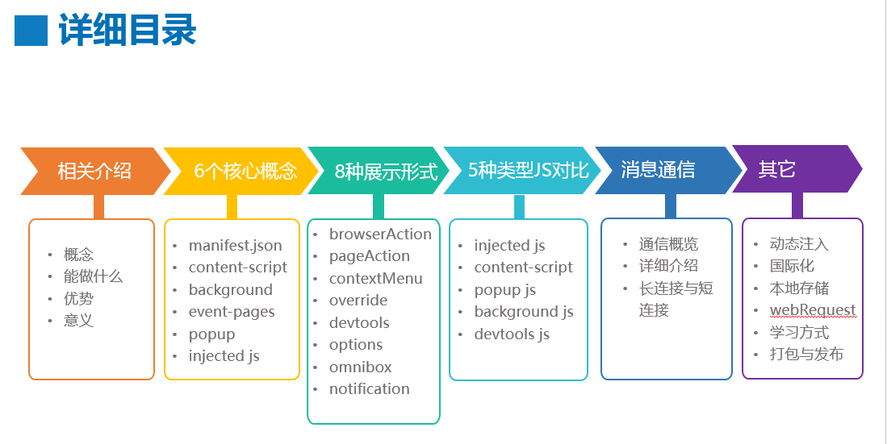

# chrome插件开发攻略



## manifest.json解析
```json
{
    "manifest_version": 2,
    "name": "username type collect extension",
    "description": "username type collect extension",
    "version": "1.0",
    // 插件用的权限（比如需要写入缓存，则要求配置storage）
    "permissions": [
        "tabs",
        "storage",
        "notifications",
        "http://*/*","https://*/*"
    ],
    // popup的icon，popup引入js，可以直接通过html内部直接script引入
    "browser_action": {
        "default_icon": "icon.png",
        "default_popup": "popup.html"
    },
    // 插件一直在浏览器后台运行的js
    "background": {
        // 如下方式, 可以依次引入多个js
        "scripts": ["lib/lodash.min.js", "background.js"],
        "persistent": false
    },
    // 直接插入到页面中的js
    "content_scripts": [{
        "matches": ["http://*/*","https://*/*"],
        "js": ["constant.js", "mockDrag.js", "collectData.js"],
        // 定制js运行方式
        "run_at": "document_end"
    }]
}
```

## chrome runtime 执行环境的区别
## 不同js的作用
## 其他暂未用到的功能

> 之前开发的爬取帐号信息的chrome插件代码：https://github.com/my19940202/ali_passportpage_validate_crx

> 翻译的chrome extension文档：https://crxdoc-zh.appspot.com/extensions/overview
> 比较详细博客： https://www.cnblogs.com/liuxianan/p/chrome-plugin-develop.html