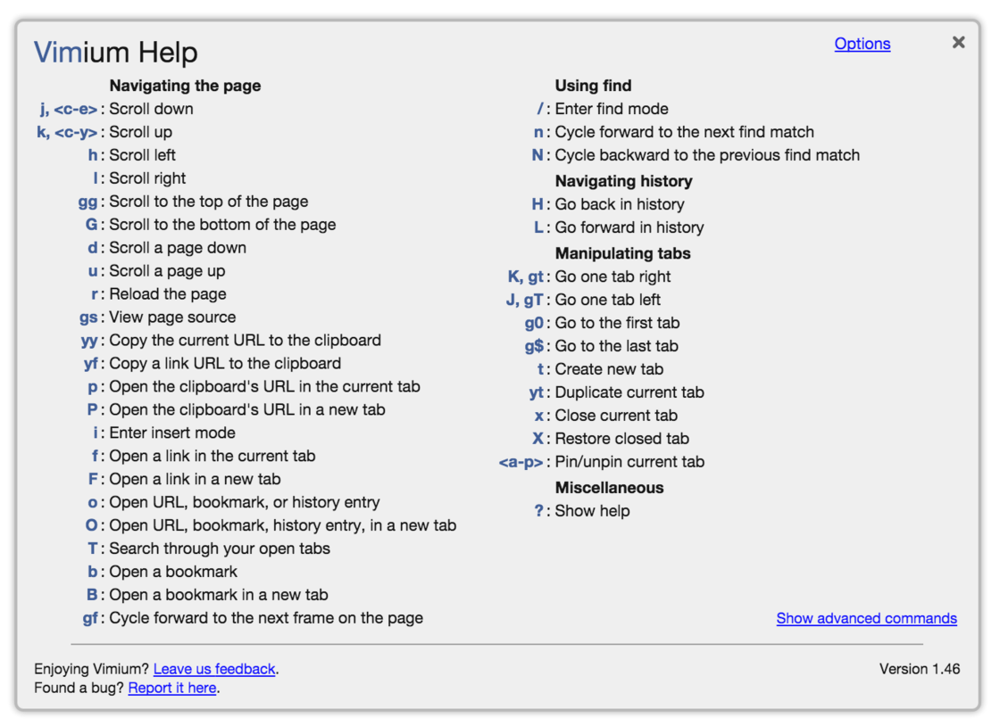

# 其他零散内容

<hr/>

## 机器学习相关的整理

[https://developers.google.cn/machine-learning/crash-course/reducing-loss/stochastic-gradient-descent?hl=zh-cn](https://developers.google.cn/machine-learning/crash-course/reducing-loss/stochastic-gradient-descent?hl=zh-cn)

谷歌机器学习的速成教程

特征

标签

梯度

<hr/>

## angular 1.x
依赖注入
* **ng-app 定义 root dom，一个页面只允许一个 app**
* **ng-controller**
* **ng-repeat**
* **ngView** `ngView`**指令的角色是为当前路由把对应的视图模板载入到布局模板中**
* **angular.module 创建，注册或检索 AngularJS 模块**
* **ui-sref、$state.go作用基本一样**
* **ng-include**指令用于包含外部的 HTML 文件

```text
angular.module('phoneDetail', [
  'ngRoute' // 此处是依赖
]);
```

## 以下俩写法效果一样

```text
angular.
  module('phonecatApp').
  component('testList', {
    template:
        `<article>
          <h1>{{name}}</h1>
          <p>{{code}}</p>
        </article>`,
    controller: function PhoneListController($scope) {
      $scope.name = 'Motorola XOOM™ with Wi-Fi';
      $scope.code = 'The Next, Next Generation tablet.';
    }
  });

angular.
  module('phonecatApp').
  component('test', {
    template:
        `<article>
          <h1>{{$ctrl.name}}</h1>
          <p>{{$ctrl.code}}</p>
        </article>`,
    controller: function PhoneListController() {
      this.name = 'Test components name';
      this.code = 'Test components code';
    }
  });
```

写法一样2

```text
angular.
  module('phoneList').
  component('phoneList', {
    templateUrl: 'phone-list/phone-list.template.html',
    controller: function PhoneListController($http) {
      var self = this;
      self.orderProp = 'age';

      $http.get('phones/phones.json').then(function(response) {
        self.phones = response.data;
      });
    }
  });

angular.
  module('phoneList').
  component('phoneList', {
    templateUrl: 'phone-list/phone-list.template.html',
    controller: ['$http', function PhoneListController($http) {
      var self = this;
      self.orderProp = 'age';

      $http.get('phones/phones.json').then(function(response) {
        self.phones = response.data;
      });
    }]
  });
```

依赖注入

```text
PhoneListCtrl.$inject = ['$scope', '$http'];
```

## filter && orderBy的使用方法

```text
<li ng-repeat="phone in $ctrl.phones | filter:$ctrl.query | orderBy:$ctrl.orderProp">
</li>
```

> [https://www.runoob.com/angularjs/angularjs-reference.html](https://www.runoob.com/angularjs/angularjs-reference.html)

<hr/>

## hadoop相关


nameNode\(存放文件的真实地址映射\)

dataNode\(存数据，放副本，数据的冗余是数据安全的保证\)

hdfs适合放大文件，由于nameNode的限制

跑hadoop任务有streaming,HCE等方式

一个简单的 streaming例子: [https://github.com/my19940202/hadoop\_streaming\_demo](https://github.com/my19940202/hadoop_streaming_demo)


## MAC 键盘符号

⌘——Command \(\)

⌃ ——Control

⌥——Option \(alt\)

⇧——Shift

⇪——Caps Lock

## VSCODE快捷键

code formatting ⇧⌥F

⌥⌘\[ + ⌥⌘\]

## **iterm 2 设置出问题 恢复default setting**

`defaults delete com.googlecode.iterm2`

## **请求CDN资源的流程**

请求cdn节点（CDN资源没有更新时，直接返回） =&gt; 源站节点（资源有更新时，cdn节点到源站节点之间的流量费用是主要成本



