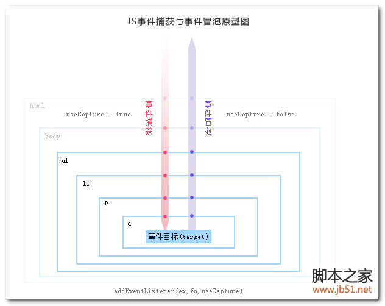

# 知识点-js

## npm install流程

运行install 过程中，其实和 react 的生命周期一样，会经历多个流程

install、postinstall、prepublish、prepare

> codesandbox 例子 [https://codesandbox.io/dashboard](https://codesandbox.io/dashboard)

## **npm** **dedupe作用**（好像是这个npm3版本开始有的新特性）

扁平化packages目录。在此之前node\_modules下面的包还有node\_modules，包的依赖蹭蹭嵌套，造成包的重复安装，体积过大。

使用了dedupe之后，会将**兼容版本**的packages置顶，减少重复安装。

不兼容的版本，仍然会存在在对应包的node\_modules下面下

\(1.2.3, 1.2.4为兼版本，和1.3.x则不兼容\)

> 具体打平目录逻辑： [https://www.npmjs.com.cn/cli/dedupe/](https://www.npmjs.com.cn/cli/dedupe/)
>
> 知乎详解npm install流程：[https://www.zhihu.com/question/66629910/answer/273992383](https://www.zhihu.com/question/66629910/answer/273992383)

## LRU cache

下面这种场景比较适合的解决办法就是lru cache

## requestIdleCallback

## requestAnimationFrame

这个函数 简单理解就是保证动画平滑不跳帧

how: **由系统来决定回调函数的执行时机 \(如果屏幕刷新60hz，就是1/60s 执行一次；刷新频率变化，也就响应变化\)**

> sandbox例子 [https://codesandbox.io/s/x7jro773vw](https://codesandbox.io/s/x7jro773vw)
>
> [https://blog.csdn.net/vhwfr2u02q/article/details/79492303](https://blog.csdn.net/vhwfr2u02q/article/details/79492303)

### JS微任务\(Microtasks\) & 宏任务\(task\)

* 宏任务：包括整体代码script，setTimeout，setInterval、setImmediate。
* 微任务：原生Promise\(有些实现的promise将then方法放到了宏任务中\)、process.nextTick、Object.observe\(已废弃\)、 MutationObserver 记住就行了。

### event loop（这是 JS执行机制） &  call back（函数调用栈）

> [https://www.youtube.com/watch?v=6MXRNXXgP\_0](https://www.youtube.com/watch?v=6MXRNXXgP_0)
>
> [https://medium.com/front-end-weekly/javascript-event-loop-explained-4cd26af121d4](https://medium.com/front-end-weekly/javascript-event-loop-explained-4cd26af121d4)

浏览器 basic architecture

* heap: 理解成浏览器专用的内存空间
* stack: 为 js 准备的一个单线程的执行环境


没有异步操作的情况下 栈结构 先进后出


存在异步操作的情况（setTimeout 也是一样的情况）


### 函数调用情况

熟悉chrome函数调用栈call stack，实例代码 [https://codesandbox.io/s/o5y4ql07zy](https://codesandbox.io/s/o5y4ql07zy)

或者也可以采用 console.trace 手动输出 [https://codesandbox.io/s/8k13wpk2qj](https://codesandbox.io/s/8k13wpk2qj)

总结： 能够显示函数的调用流程


### 闭包问题

提供可以访问函数内部变量的方法

可以从函数参数传值和传址角度思考

基础变量（number String Boolean）都是传值的，在函数内部修改后不影响原始值

引用类型（obj,array，func）都是传址，在函数内部修改会影响原始值

### 基础数据类型

> null undefined number string array object Boolean

### 低速网络环境下的js载入异常问题

> A Parser-blocking, cross-origin script is invoked via document.write. This may be blocked by the browser if the device has poor network connectivity
>
> 翻译：在弱的网络连接环境下，在页面上使用document.write\(\)来动态插入外部的脚本会阻塞页面的解析
>
> 结果：延迟页面的显示，甚至加载脚本失败，最终导致页面不能正确显示

Chrome对于由document.write\(\)动态插入的&lt;script&gt;会做检查，当满足下面所有的条件下，Chrome不会执行加载&lt;script&gt;里的脚本。

* 用户处在弱网络连接的环境下，可能是234G
* document.write\(\)在主页面里，对于那些嵌入在iframe里的页面没有影响
* 在document.write\(\)插入的脚本是阻碍解析的（parser-blocking）。如果插入的&lt;script&gt;标签加了 'async' 或'defer'属性，脚本会异步加载，不影响解析 ，所以也是能被执行的。
* 加载的脚本和不是其他域名。
* 脚本没有在浏览器的缓存里
* 页面不是重新加载

### js事件

事件委托: 用于处理子元素很多\|\|会更新的场景

```text
传统方式
    var oUl = document.getElementById("ul1");
    var aLi = oUl.getElementsByTagName('li');
    for(var i=0;i<aLi.length;i++){
        aLi[i].onclick = function(){
            alert(123);
        }
    }

非事件委托方式
    var oUl = document.getElementById("ul1");
　　oUl.onclick = function(ev){
　　　　var ev = ev || window.event;
　　　　var target = ev.target || ev.srcElement;
　　　　if(target.nodeName.toLowerCase() == 'li'){
　 　　　　　　    alert(123);
　　　　　　　  alert(target.innerHTML);
　　　　}
　　}
```

addEventListener\('click', function\(\){}\); //默认冒泡

event.stopPropagation\(\) //阻止冒泡

addEventListener\('click', function\(\){},true\); // 设置捕获类型

event.preventDefault\(\) //阻止捕获



## es6相关问题 &gt;\_&lt;

### generater啥玩意

### yield啥玩意

### export default

> #### 一个文件中export default只有一个，在其他模板中 import的时候 不需要带{}

## 浏览器层面

### 浏览器解析基本流程


### repaint

元素样式变化，但没引起布局变化（color opacity啥的）

### reflow变化大，成本更高

改变窗口大小

1. 改变字体
2. 增加和删除样式表
3. 内容的改变，比如用户在输入框输入文字
4. 激活伪类
5. 操作class属性
6. 脚本操作DOM
7. 计算offsetWidth和offsetHeight
8. 设置style属性

> [https://segmentfault.com/a/1190000006104095](https://segmentfault.com/a/1190000006104095)
>
> [https://segmentfault.com/a/1190000002629708](https://segmentfault.com/a/1190000002629708)


## await async的理解

[http://jsrun.net/tahKp/edit](http://jsrun.net/tahKp/edit)

## promise理解

**古人云：“君子一诺千金”，这种“承诺将来会执行”的对象在JavaScript中称为Promise对象。**

**Promise最大的好处是在异步执行的流程中，把执行代码和处理结果的代码清晰地分离了**

参考示例 [http://jsrun.net/EggKp/edit](http://jsrun.net/EggKp/edit)

> [https://www.liaoxuefeng.com/wiki/001434446689867b27157e896e74d51a89c25cc8b43bdb3000/0014345008539155e93fc16046d4bb7854943814c4f9dc2000](https://www.liaoxuefeng.com/wiki/001434446689867b27157e896e74d51a89c25cc8b43bdb3000/0014345008539155e93fc16046d4bb7854943814c4f9dc2000)

## CSRF问题处理（伪造请求 直接往接口发送）

1. **CSRF是跨站请求伪造（Cross-site request forgery）的英文缩写。**
2. **跨站请求伪造是一种通过伪装授权用户的请求来利用授信网站的恶意漏洞**

**解决方案**

1. 后端限制只接受对应refer的request
2. 请求中要包含用户身份token
3. 前端发请求时 带上后端第一次页面载入带来的token

[https://laravel-china.org/articles/6735/laravel-csrf-attack-and-defense](https://laravel-china.org/articles/6735/laravel-csrf-attack-and-defense)

