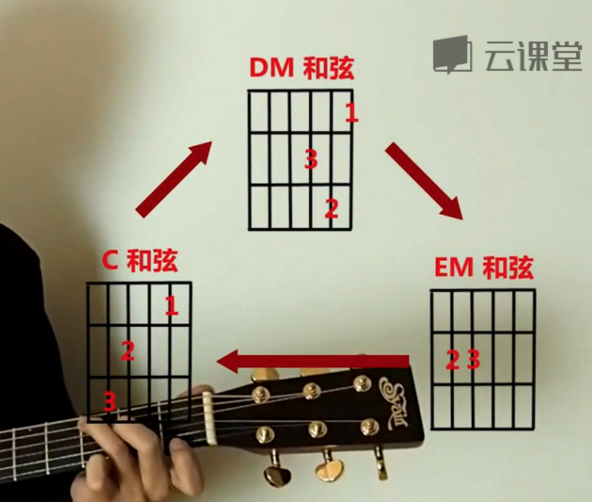

# 乐理知识学习汇总

### 音乐三要素（音色 节奏 旋律） **节奏最重要**

全音半音

C调的1234567 基本音

倍低音 低音 高音 倍高音（点在上下 进行区分）

调: CDEFGAB

## 练和弦手指疼是常态

## 左手按品的姿势

拇指指肚按住背部 和食指对齐 便于发力

## 打拍子\(需要结合节拍器将自己的节奏感先练好\)

## **和弦转化**

和弦切换的时候 需要 先把提前按好品和弹出弦

## 歌词踩点的难度

刚开始节奏感不够强，记清楚每个字对应的弦，硬凑凑多了就会养成节奏感

和弦发声要包含下面的1 3 5

和弦的根音就是声音最低那个弦发出的声

E\(E major\) Em\(E minor\)

## 搞音乐的同事 告诉我我的节奏感方面需要好好加强

（日常走路的时候 都可以打着拍子 加强自己的节奏感）

手脚节奏会乱的情况下 手脚的动作分开练习

1. 弹奏的时候 节奏是最重要的 不能停下来 弹错就弹错 要重视整体体验
2. 弹错的情况下 要注意调整 修改回来

