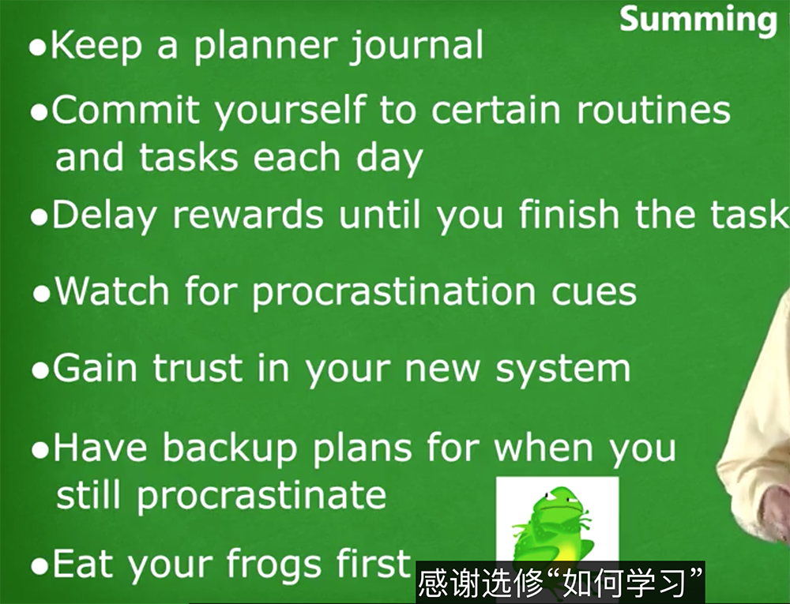

# learning about learning

## **week 5**

左右脑的作用角色

左脑就是 老夫就是一把梭那个老头 专注模式 只管干

右脑唱反调 就是过cr 挑刺的

关于考试的技巧

先难后易 ，先从看难的问题开始，如果无法解决时，立刻switch到简单项目上，然后循环往复

这样的操作 有一下的好处

1. 不至于在难题面前卡壳，解决难题的时候 处于专注模式，很难分散思维想到其他解决方法，这样处理起来，保证了思维的发散，避开思维定势
2. 这样的操作，能解决足够多的题目，不至于卡到一个题目卡死。

对工作的过度自信，将会导致工作上思维方式的单一化，可能确认创新能力

## **week 4**

视觉记忆的特殊性

**long term momery and working memory**

long term momery

像一个大仓库，需要长期的复习和重复

working memory

像个小黑板，只能记录有限的内容

记忆东西的方法

* 结合上形象的视觉形象
* repeation 重复
* 连接 已有的其他记忆

比如记一首曲子，结合曲子的名称，演奏风格，mv 等 加深影响（尽可能调用更多的感官）

海马体： 承载记忆的地方（有个切除了海马体的人 不能记住新东西，能和这人聊天 但是几分钟后他就忘了和你聊了啥，以前的记忆还在，也记不住手术前几年的事情）

说明 memory solid =&gt; long term memory 需要海马体参与，并且花费数年

记忆可以创建一些有意义的小方法， 比如之前学英语时 用的搞笑的小例子

随着自己的深入理解，这些小例子会转化成的真正理解的内容

## **week 3**

zoombie mode 比如开车的时候用到的那种毫无意识的手脚动作控制，整个大脑只有一个开车的 key pointer

克服拖延症的办法（客服几个坏习惯，培养几个好习惯）

主要的原则其实就是改变自己对某些事情的 action

* the cue（信号） 触发拖延症的信号 事件
* the routine 惯式，制定计划
* the belief
* reward
  * 习惯的能力之所以强大，因为习惯控制神经系统的欲望
  * reward 的小例子： 内心和自己打赌、完成就奖励自己拿铁。。。，奖励可以越来越大
  * reward 的原则 实用而且有明显的截止时间

生活工作中可以具体应用的建议 \(详见下面的截图\)

1. 写下睡觉前写下明天的todoList

1. **week 1**

thinking mode 分为：focuse mode & diffuse mode

[https://www.coursera.org/learn/ruhe-xuexi/home/week/3](https://www.coursera.org/learn/ruhe-xuexi/home/week/3)

a little bit every day that's the way to learn.

拖延症的物理层面

when you look at something that you really rather not do ,actually you acvative the area associated with pain

记忆概论

long term memory 像电脑的硬盘 长效

working memory 像电脑的内存 经常进进出出

当一段记忆需要进入 long term memory 需要大量的回顾，间隔性的锻炼有利于加强神经突触稳固链路

冗长的会议 如何保持的注意力集中 用问题伏击演讲者

睡眠帮助大脑加深白天学习的内容（睡眠，大脑进入 diffuse mode 会删掉一些无用记忆，加深你要学习的内容，如果睡前自我暗示，效果会更好）

## **week 2**

chunk

学习新知识的时候，形成 chunk 是一个重要的步骤

微观层面，chunk 就是让多个神经元们共同运作的网络，让人能够高效、流畅的完成某件事情；

宏观方向上，chunk通过相互的联系组合到一起的不同的信息块

借助 chunk，不需要记住系统的每个细节，只要记住主要概念和主要的chunk，

总结起来应该就是结构化思维

**how to form a chunk**

学习新知识时，大脑一般的操作都是 进入发散模式，将新知识和老知识联系起来，新知识点发散到整个脑海里

essential steps of make chunks

1. focused attention on learning
2. understanding && make sense what u learn 
3. practice and repeat

**illusion of learning**

recall is a good to solid chunk

common illusion of learning： 扫了一眼答案 就觉得自己知道怎么解题了, 实际上解题思路还没有在你的脑回路中留下痕迹

1. 总结归纳是个好东西
2. 自测是个好方法检测是自己是否掌握知识（另外一种形式上的 recall）

**多巴胺、乙酰胆碱、血清素**

多巴胺 ****released when get unexpected reward

毒品就是促进多巴胺分泌的

血清素 影响社交生活

交际花 血清素高，血清素低可能冒险行为更多

building chunk library

**overlearning**

在学习阶段，已经理解了某种概念后，还持续的练习改概念，

give you the illusion of competence, 阻止去学习更难的部分

