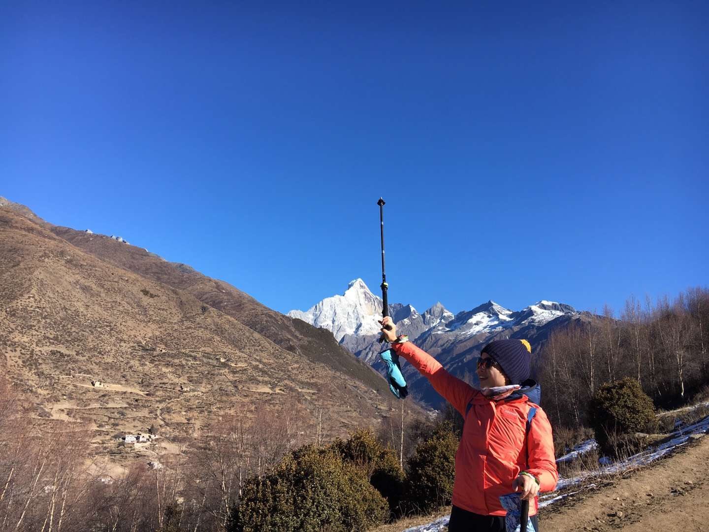
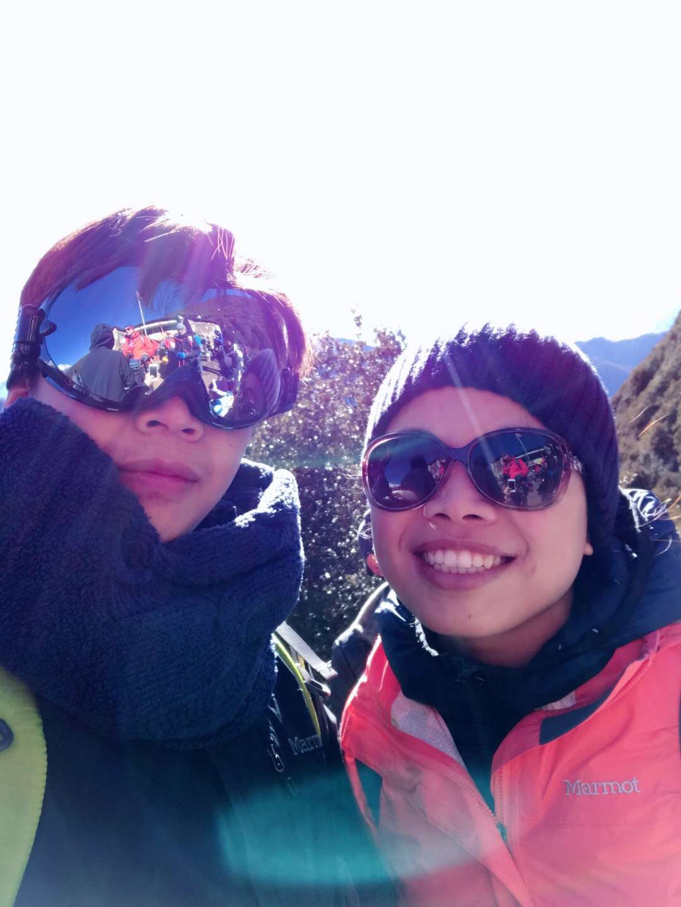
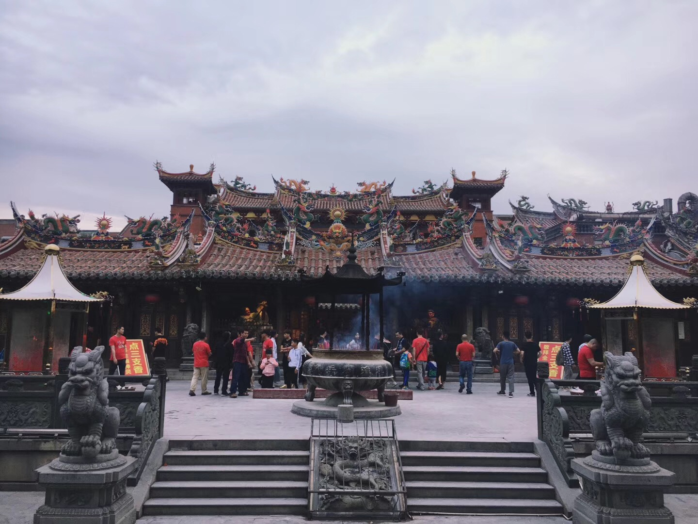
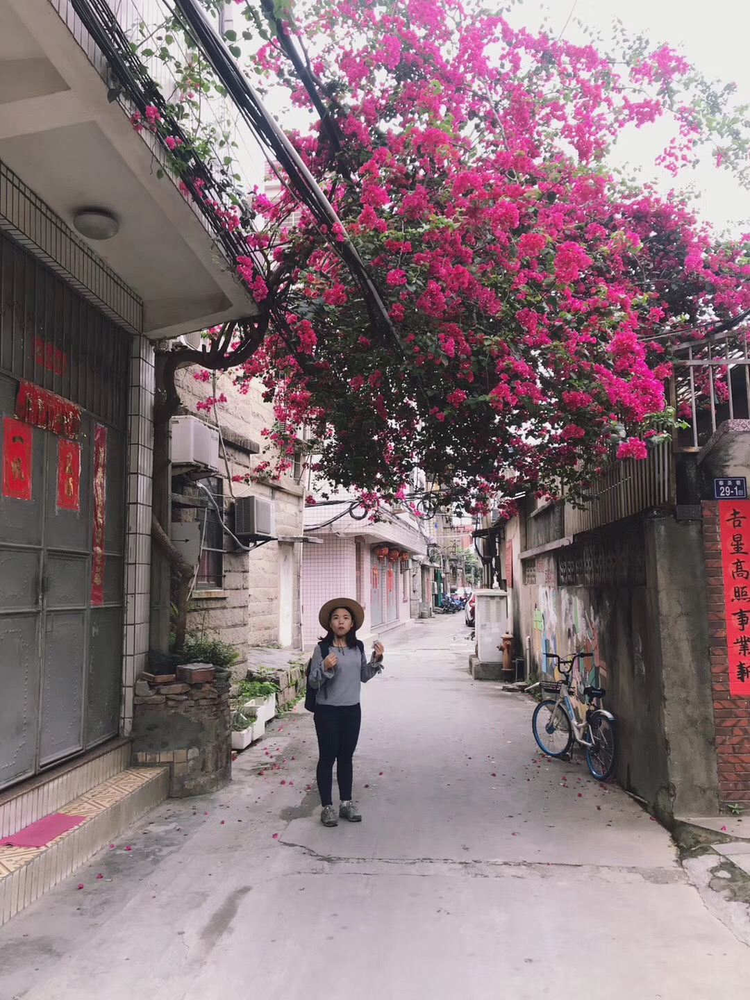
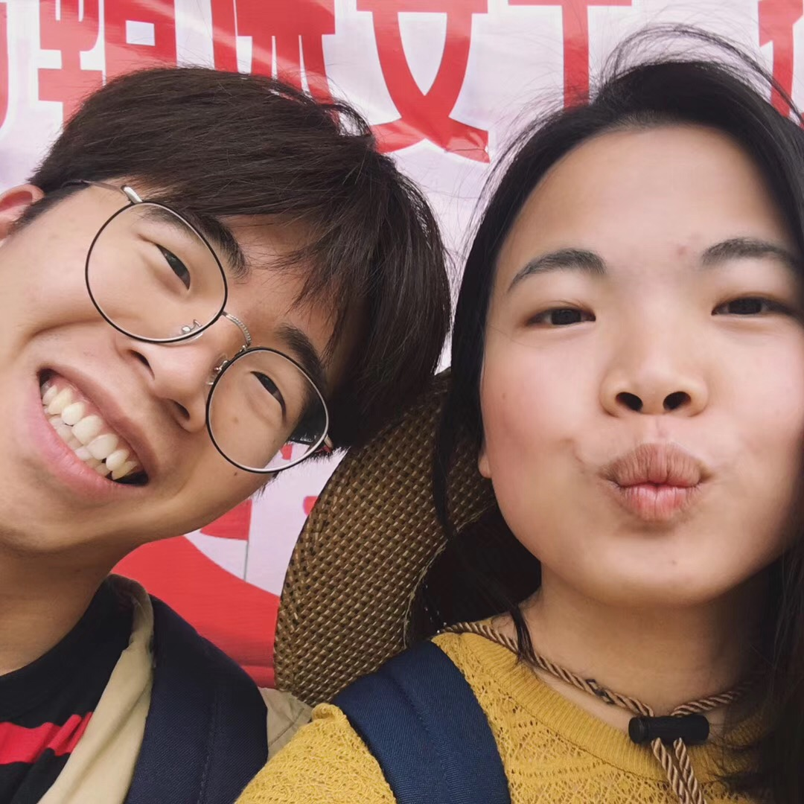
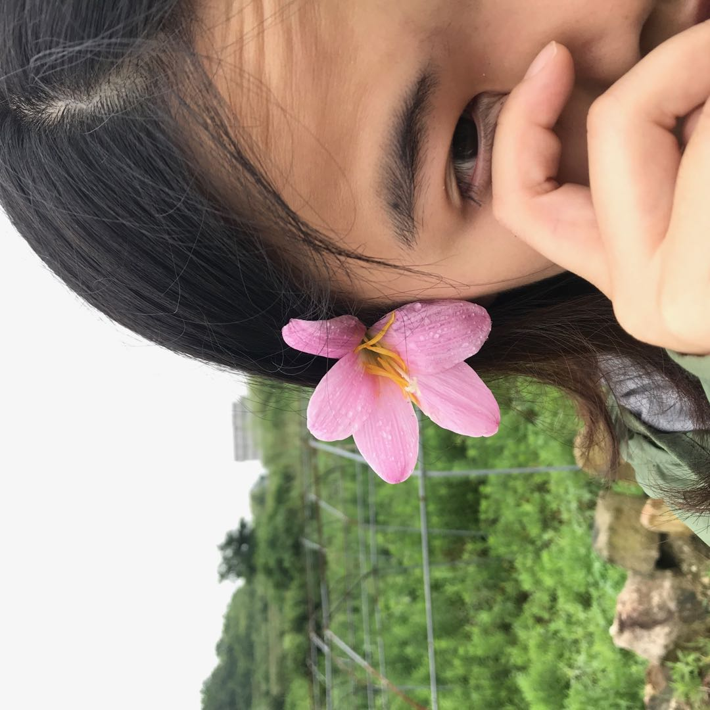
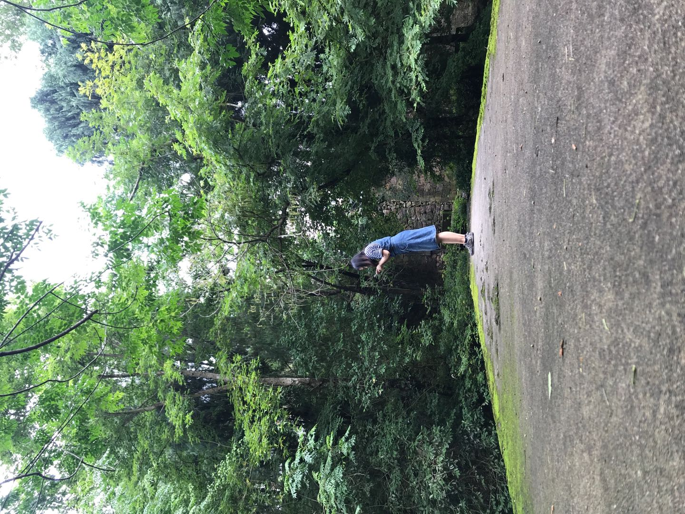

##  女朋友的信
> 亲爱的女朋友
我现在想不清楚上一次写信是什么时候了，趁着下午有空（实际挺忙的），回顾了女朋友和半年来的生活，
感谢女朋友的陪伴，祝我的小可爱生日快乐。

### 初识
<iframe 
    height=800 
    width=800
    src="http://hbhss1e4qimrkzbqgfn.exp.bcevod.com/mda-jf9m78qiys0py036/mda-jf9m78qiys0py036.mp4" 
    frameborder=0 
    allowfullscreen>
</iframe>
 
> 之前的世界杯聚会，这小姑娘还挺不错的，厨艺可以，看着性格不错。
当晚就“睡”在一起，靠得很近，掠激动，但是还是抵不住睡意。

### 游玩
#### 四姑娘（女朋友带着我上到了海拔海拔4000多米的高山，睡了-20度的草地）

#### 泉州，厦门（女朋友带我去泉州厦门，吃吃吃喝喝喝）

#### 天台（我带去女朋友去喂蚂蝗，蚊子）

体会到了之前女朋友带我出去玩的心路历程，需要更加深入关注

### 女朋友给我的做的菜
https://www.douban.com/photos/album/1688950316/

### 学习到的东西
- 逻辑思维能力：独立思考，批判性思维等能力
- 健康相关知识

### 总结
祝谢依林同学，生日快乐，新的一岁刷新新成就，早日成为JA中国区负责人
男朋友会继续努力，追赶女朋友的脚步（大脑和身体都会追赶）

