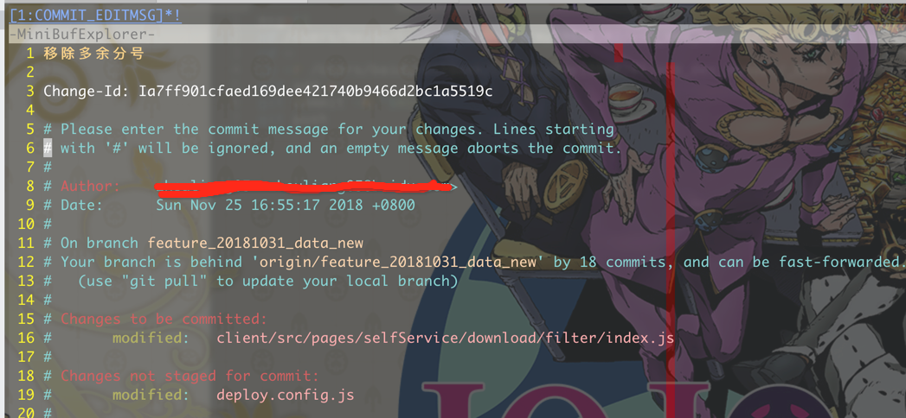
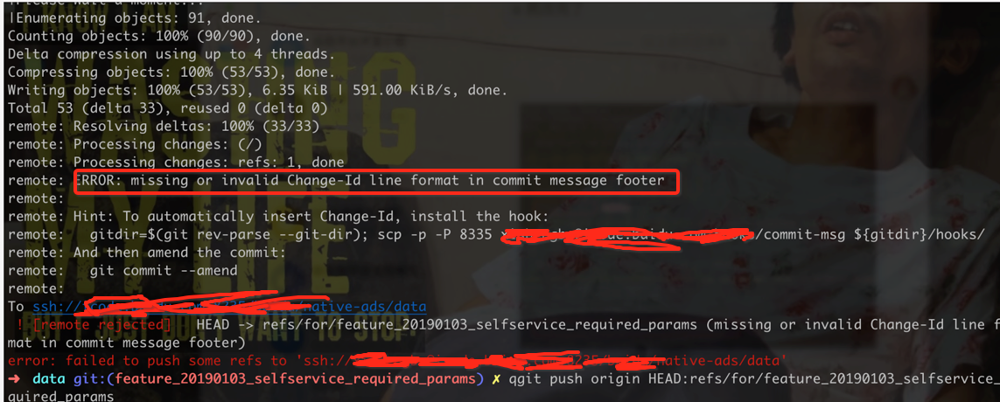

# linux命令
> linux比较完善的速查手册：https://linuxtools-rst.readthedocs.io/zh_CN/latest/tool/crontab.html

## shell语言备忘录
### 系统常量
```shell
# 特殊常量
echo "File Name: $0"
echo "1st Parameter : $1"
echo "2nd Parameter : $2"
echo "all Parameter: $@"
echo "all Parameter: $*"
echo "Total Number of Parameters : $#"
echo "ppid : $$"
```
### 变量类型
- 数组
```shell
query_arr=("滤芯" "净水器滤芯" "鲜花" "美国移民")
```
- 字符串
    - 赋值(等号左右不允许有空格,x="xxx")
    - 字符串拼接（例子如下）
    - 注意点
        - 单引号里的任何字符都会原样输出，单引号字符串中的变量是无效的；
        - 单引号字串中不能出现单独一个的单引号（对单引号使用转义符后也不行），但可成对出现，作为字符串拼接使用。
        - 双引号可以变量替换
        - 反引号（命令替换）
```shell
x="fufufufu"
date=`date -d 'yesterday' '+%m%d'`
echo $x
echo ${x}
echo "test-"$x
echo "this is y ${x}"
# 注意： ''中变量不会转义
echo 'this is y ${x}'
```

- 注释
    - 单行#
    - 多行(比较麻烦暂时忽略)

### 流程控制
- if
- for

```shell
#-gt是大于
#-lt是小于
#-eq是等于
#-ne是不等于
#-ge是大于等于
#le是小于等于   

if [ -z "$1" ]
  then
    echo "No arguments supplied "$1
  else
    if [ "$1" -gt 10 ]
      then
        echo "参数大于10："$1
      else
        echo "参数小于10： "$1
    fi
fi

# for i in {1..10}
# do
#    echo $i
# done

# (( ))
# for((i=1;i<100;i++))
# do
#     if((i%10==0))
#     then
#         echo $i
#         continue
#     fi
# done
# 

for File in 1 2 3 4 5
do
    echo ${File}'12345'
done
```

<hr/>

## 常用命令
| 类型 | 命令 | 作用 |
| :--- | :--- | :--- |
| 文件操作 | ls 20161_.log_ _ls20160\[1-9\]_.log | 正则方式筛选输出 |
| 文件操作 | tar --exclude="umi-demo/node_modules" -zcvf target.tar.gz sourcefile | 压缩 |
| 文件操作 | gzip -9 xx | 会覆盖源文件 |
| 文件操作 | tar -zxvf target.tar.gz | 解压缩 |
| 文件操作 | du -hs path | 查看文件大小（Mb单位） |
| 文件操作 | df | 磁盘情况预览 |
| 文件操作 | cp -r xx yy | 递归方式拷贝（拷贝所有文件和文件夹） |
| 文件操作 | wget http://a.com/b.jpg -P pic/ | wget指定文件存放的目录 |
| 文件操作 | chmod 755 imgcat chmod +x xx.sh chmod -x xx.sh | imgcat是imgcat.sh去掉了后缀名,可以直接./imgcat\(shimgcat.sh\) |
| 文件操作 | scp -r username@servername:/path/filename /target/path | 拷贝别人开发机的文件\(-r拷贝所有文件和文件夹\) |
| 文件操作 | find . -name'\*.png' -depth2 | 深度为2时查找png文件 |
| hadoop | hadoop fs -getmerge /app/2016data.txt | 2016目录下的所有文件merge到data.txt中 |
| hadoop | hadoop fs -cat,-ls,-dus,-rmr | fs类型的多种操作 |
| 进程 | ps -ax ps-le¦grepnode | 查看进程,加上grep进行各种过滤 |
| 字符处理 | iconv -f 'utf-8' -t 'gbk' a.tx > b.txt | utf8 => gbk |
| 字符处理 | grep -o 'xxx' data.txt ¦ wc -l grep -r 'name' ./ grep -a1 'name' ./ | data.txt中的xxx的出现次数 查看当前目录下面的所有含有name字符串的文件 输出上下一行\(a1\), 下一行\(A1\) |
| 字符处理 | sed 's/\t/,/g' data.txt | data.txt中的tab > ',' |
| 字符处理 | sed -n '5,10p' data.txt sed -n '10p' data.txt cat nohup.out¦ head -n 100 cat nohup.out¦ tail -n 100 | 看5-10行，看第10行,头100，尾100 |
| sort | sort -n -r -k2 -t':'result > result\_sorted | key:value形式的文件按照value进行排序 |
| 其他 | date +%Y-%m-%d date -d yesterday +%Y%m%d date -d tomorrow +%Y%m%d date -d '30 days ago' +%Y%m%d | 时间获取 |
| 其他 | tailf nohup.out | 一旦nohup.out更新就去刷新输出 |
| 其他 | crontab -e | 定时任务配置 |
| 其他 | git remote -v | git查看remote仓库地址 |
| 其他 | npm list --depth=12 > /dev/null | 查看npm以及目录安装的包（过滤错误信息） |

### sort专题

```text
$ cat test.data
a 1
b 2
c 99
d 0
e 91
f 3
# -r 降序 -n 升序 -k1 k2 (指定排序key)
$ cat test.data | sort -k1 -n 
a 1
b 2
c 99
d 0
e 91
f 3

$ cat test.data | sort -k2 -n
d 0
a 1
b 2
f 3
c 99
# 去除重复行
$ sort -n test.data | uniq

// 文件交集，并集，差集 参考下面的链接
集合A,B，A与B的差集指的是属于A且不属于B的部分
场景：文件A B，B是A的子集, A中没有在B中出现过的元素
$ cat A.txt B.txt B.txt | sort | uniq -u > ret.txt
```

> [https://blog.csdn.net/stpeace/article/details/50407106](linuxming-ling.md#httpsblogcsdnnetstpeacearticledetails50407106)

### grep专题

```text
高亮处理 --color=auto
# match 多个关键字
grep -E 'xxx|yyy|zzz' data

# invert -match 不包含的关键字
grep -v     'xxx|yyy|zzz' data

# 输出目标结果（输出 xfuck you x）
echo "asdxfuck you x1231" | grep -o     'x.*x'

# 关于正则
## 元字符 \b \w \W
## []代表范围
grep "[0-9]" data #match 数字
grep "[789]" data #match 789
grep "[^0-9]" data #match 数字取反
grep "[^a-zA-Z0-9]" data #match 特殊字符
grep -oE '\b[a-zA-Z]+\b' words.txt #match word
## {}重复的次数
[0-9]\{1,3\} match 1~3位的数字

## *?+ 重复字符
*: 重复次数 n 
>
= 0
+: 重复次数 n 
>
= 1
?: 重复次数 n = 0 || 1

num* match "nummmm" "num" "nu"
num\+ match "nummmm" "num" 至少要有一个
\(re\)* match 'rerere' 和空行
\(re\)\+ match 'rerere' 去掉了空行

##例子
匹配 log中的tu字段
grep -oE "tu=u[0-9]{6,7}" --color=auto
```

### awk专题

```text
#!/bin/awk -f
# FS指定列分割符 OFS列输出分隔符
BEGIN{
    FS = OFS = "\t";
}
{
    split($1, key, "#");
    new_key = key[1]"#"key[3];
    if (key[2] == 0) pv1[new_key] += $2;
    pv2[new_key] += $3;
    clk[new_key] += $4;
    gain[new_key] += $5;
    cnt[new_key] += $6;
}
END{
    for (i in pv1) {
        print i, pv1[i], pv2[i], clk[i], gain[i], cnt[i];
    }
}


##脚本方式调用
-F 定义间隔符
awk -F ',' '{print $1,$4}' new_data
awk -F ',' '{print "name:"$1"\tbirthday"$4}' new_data

内置参数的使用
awk -F "," "{print NR,NF}" new_data
NR 行号 NF 字段数量
awk -F "," '{printf("Line:%s,Col:%s\n", NR,NF)}' new_data
```

```text
# for 输出没有按照下标来的
$ awk 'BEGIN{info="this is a test";split(info,tA," ");print length(tA);for(k in tA){print k,tA[k];}}'
4
2 is
3 a
4 test
1 this

# 文件夹文件大小总计
ls -l | awk  'BEGIN{size=0} {size+=$5} END{print "size is " size}'
# stat 非空行数
awk 'BEGIN{cout=0} $1!~/^$/ {cout+=1} END{print "line number is"cout}' list_data
# stat第5行后面的数据
awk -F ',' 'BEGIN{cout=0} {if (NR 
>
 5) name[cout++]=$1} END{for(i=0;i 
<
 cout;i++) print i,name[i] }' list_data
```

## curl进行请求

```text
# 其他细节可以  curl -h 自己查看

curl -i -X POST \
-H "application/x-www-form-urlencoded; charset=UTF-8" \
-d \
'{"pageNo":"2","pageSize":"10"}' \
'http://cpu.baidu.com/1003/d77e414'
## get 请求
curl -G http://imageplus.baidu.com/ui

## curl 带上 cookie请求
curl --cookie "name=fuckyou" http://xx.com/api
```

> for循环发送请求

```text
query_arr=("滤芯" "净水器滤芯" "鲜花" "美国移民");
for((i=1;i
<
=50;i++));
do
query_idx=`expr $i % 4`;
curl -i -X POST \
-H "application/x-www-form-urlencoded; charset=UTF-8" \
-d \
'{"magic_num":778,"channel_page":"pc_ns_wenku_yuedu_tab","query":"'${query_arr[$query_idx]}'","pre_query":"'${query_arr[$query_idx]}'","search_id":2292132705,"charge_name":"ksws3","encode_type":0,"experiment_id_list":[2018011603],"user_ip":2319884839,"baidu_id":"A46A9B49722108FC124D78FF6C451418","passport_user_id":0,"url":"https://p.baidu.com/question/7b4f6162633531346463360200/398307","refer":"http://p.baidu.com","device_info":{"user_agent":"Mozilla/5.0"},"service_control":{"union_title":"十二生肖之六合","union_charge_tag":"tag1##tag2"},"cookie_info":[],"http_headers":"","wise_req_info":{"wise_adapter":"","wpt": 2}}' \
'http://10.150.93.38:8101/asp'
done
```

> post发送formdata形式的请求

```text
#!/bin/bash
curl \
  -F "code=GBK" \
  -F "name=woshinimamamam" \
  -F "file=@/Users/baidu/Desktop/xx.txt" \
  xxyyzzaabbcc.baidu.com:8089/amis/download/word-table/upload?AMIS_USER=xishengbo
```

## 环境变量添加

```text
# 新增了一个hadoop client
export PATH=$PATH:/home/xishengbo/hadoop_client_yq/hadoop/bin
```

## svn

```text
svn commit -m “恢复到某修订版（某修订版作废）”
```

## 权限赋予

```text
理解 文件、目录的权限的不同 r w x

让 xxx.sh 可执行即为 ./xxx.sh 运行
chmod 777 xxx.sh

让 xxx.cpp不可执行
chmod -x xxx.cpp
```

## 模板测试服务的快速重启

```text
rm lu-ui
rm ../log/*log*
wget http://10.145.78.238:8114/output/bin/lu-ui
chmod 777 lu-ui
kill $(ps aux | grep 'bin/lu-ui' | awk '{print $2}')
```

## 进程放入后台以及切换到前台

```text
vim界面下 ctrl + z (其他占用终端的进程也是一样)
要回到前台   
jobs 查看当前后台任务
通过 fg 1 切换回来
```

## 文件大小排序

```text
ls -Slgrepr
```

## tmux的使用

```text
用于缓存自己的开发环境 不用每次开发的时候都重新打开环境
tmux
tmux ls
tmux kill-server
tmux kill-session -t s_name
tmux attach -t s_name
ctrl + b + n/p  (next previous window)
ctrl + b + $ (rename)
ctrl + b + % (split window 水平方向)
ctrl + b + " (split window 竖直方向)
ctrl + b + l (split window switch)


重新命名窗口： ctrl + b + ,
关闭tab： ctrl + b + x
断开连接 ctrl + b + d


tmux使用了主题  感觉样式可以

>
>
 https://github.com/shfshanyue/tmux-config

>
>
 https://segmentfault.com/a/1190000003001555
```

## mysql操作

```text
mysql -uUSERNAME -pPASSWORK -P4100 -hHOST test_db --default-character-set=utf8
mysql -uxishengbo -pWNXhRY4L9Q -P4100 -hst01-dba-sdc-bak03.st01 cb_webdb --default-character-set=utf8

waptuList="111,2222,333"
select ad_param from ad_demand  where  ad_position_id in ($waptuList)
order by create_time
group by group_id
DATE_FORMAT(st_date, "%Y-%m-%d")

// like的用法
like "%xsb%" 
not like '%"tag_orient":""%'

// 正则用法
SELECT name FROM person_tbl WHERE name REGEXP '^st';
```

## 网络相关

```text
## 查看请求baidu.com 数据包所经过的IP节点 一般用于问题排查
traceroute baidu.com
netstat 查看本机端口的状态
```

## 发压力测试

```text
ab -c 2 -n 10 http://127.0.0.1:8800?c=1
&
b=1
各类限制条件自己看参数吧 get post都能发的
```

## 观察/bin有没有完全启动起来的方法

* 通过top命令 看改程序的 cpu占用情况，一般刚开始启动 占用很高（做各种初始化工作，载入配置等等）
* tailf 观察log目录log，一般启动完成后 日志量开始增加

## git相关

```text
“在分支开发提交了好多次，其中一次merge master冲突，最后合入失败可以用这个办法处理（相当于回滚之前的多次 commit,适用于分支没有push的场景）”
git reset --soft origin/master
git commit --amend // 提交后还没push的情况下update commit msg

git reset --hard origin/master # 强制用 remote 覆盖本地
git diff commitid1 commitid2 查看某两个版本之间的差异
git diff commitid1:xx.txt commitid2:xx.txt 查看某两个版本的某个文件之间的差异
git stash 已有的变更不想保存的时候 想切换到其他分支上或。。。 将修改放入堆栈
git stash list 看看有哪些堆栈
git stash drop stash@{2} 删除这个修改
git stash apply stash@{2} 恢复到 stash@{2} 这个变化
https://git-scm.com/book/zh/v1/Git-%E5%B7%A5%E5%85%B7-%E5%82%A8%E8%97%8F%EF%BC%88Stashing%EF%BC%89
```

> git commit --amend 注意事项： 有的时候一部小心把 change id 改没了，再去提交就会出现下面的提示（所以amend操作也有分险，公司内网的git有过定制化配置会有changeid输出，外网的github检查了一下没有changeid）



## vim

```text
set list 来显示非可见字符
set nolist 隐藏
制表符被显示为“^I”，而行尾则标识为“$“
%s/,/\r/g 都好替换成换行（\r vim 里面表示换行）

cat
asdfasd asdfads
    asdfads
dafd    asdfads
d    asdfads
fd    asdfads
asa    sd
asa    sd
sa    sd

vim
asdfasd asdfads$

>
---asdfads$
dafd
>
---asdfads$
d
>
--asdfads$
fd
>
-asdfads$
asa
>
sd$
asa
>
sd$
sa
>
-sd$
```

## linux环境变量相关使用方法

echo 显示某个环境变量值 echo $PATH  
export 设置一个新的环境变量 export HELLO="hello" \(可以无引号\)  
env 显示所有环境变量  
set 显示本地定义的shell变量  
unset 清除环境变量 unset HELLO

```text
/*test.js*/
console.log(process.env.PORT, "this is port");

/*
env PORT=8093 node test.js
export PORT=8093
&
&
 node test.js
result: 8093 this is port
*/
```

## fis使用

```text
fis3 release -wL (watch模式动态 release）
fis3 release -d ./output (打包文件到某个目录)
fis server start stop restart
```
