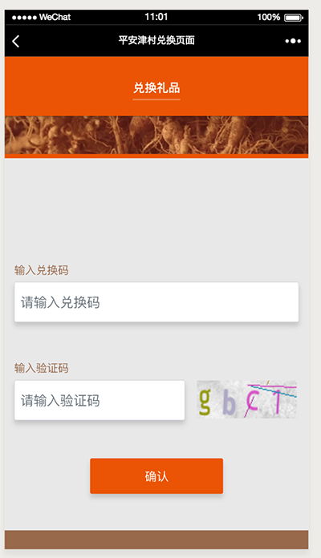

# vue相关学习

### \(2018-07-11~2018-08-03\)

## 总结：

这是有史以来项目周期最赶的项目，身心疲惫，感觉后面要好好考虑是不是要接私活

## 需求分析：

这一次接的项目是平安下面汉方医药公司, 有两个端h5兑换页面以及后台兑换管理系统

h5页面提供了设计图

后端管理系统只给了设计草图

主要是增删改查操作，支持整个兑换商品的流程

## 技术方案：

刚开始我是想用 react antdesign 那一套解决方法，不过最后因为这个项目不是前后端分离的，只能在原来项目框架上开发；

后面采用了 vue，element-ui 这套解决方法

> 当然其中 就遇到了 vue 以及 element-ui的一些列坑
>
> 1. vue 在 table 情况下，json 深度太大，没有办法检测到 json 的变化，这个时候采取深拷贝
> 2. vue 组件初始化问题，省市区的表单联动情况，多次涉及到初始化问题，显示异常
> 3. 图片上传 formData 图片 FileReader 对象 （因为使用了 element-ui的upload 组件，图片上传问题一度很混乱）

[阿里云的代码库地址](https://code.aliyun.com/pajc-members/nurun-projects-pajc-website?spm=a2111a.8458726.0.0.6c6c7a7f5TDBK0)

[https://github.com/my19940202/simple\_vue\_crm](https://github.com/my19940202/simple_vue_crm)

## 排期：

原计划是两周半时间完成h5页面以及后端管理系统的开发

2018-07-11~2018-08-03 将近三周时间 其中将近三天加班到 凌晨3 4点（白天干不了私活 只能晚上偷偷干干）

然后那段时间公司的项目也不是那么轻松

2018-08-04

相关图片素材

[http://pajc.nurunci.com/ba/dashboard\#/](http://pajc.nurunci.com/ba/dashboard#/)

[https://pajc.nurunci.com/campaign/card/index.html](https://pajc.nurunci.com/campaign/card/index.html)

[https://pajc.nurunci.com/campaign/card/code.html](https://pajc.nurunci.com/campaign/card/code.html)

