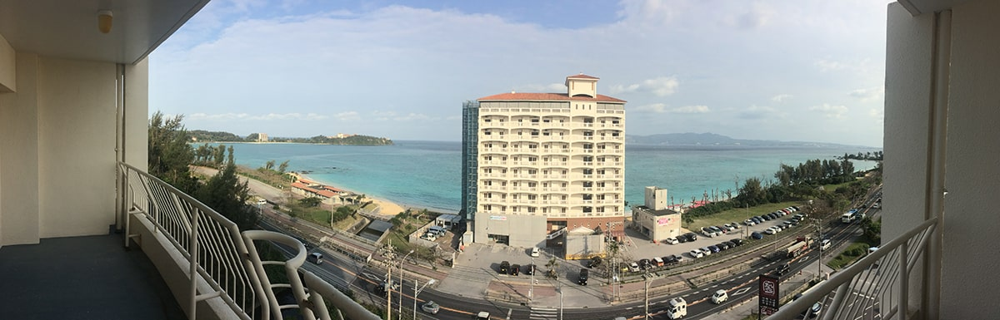
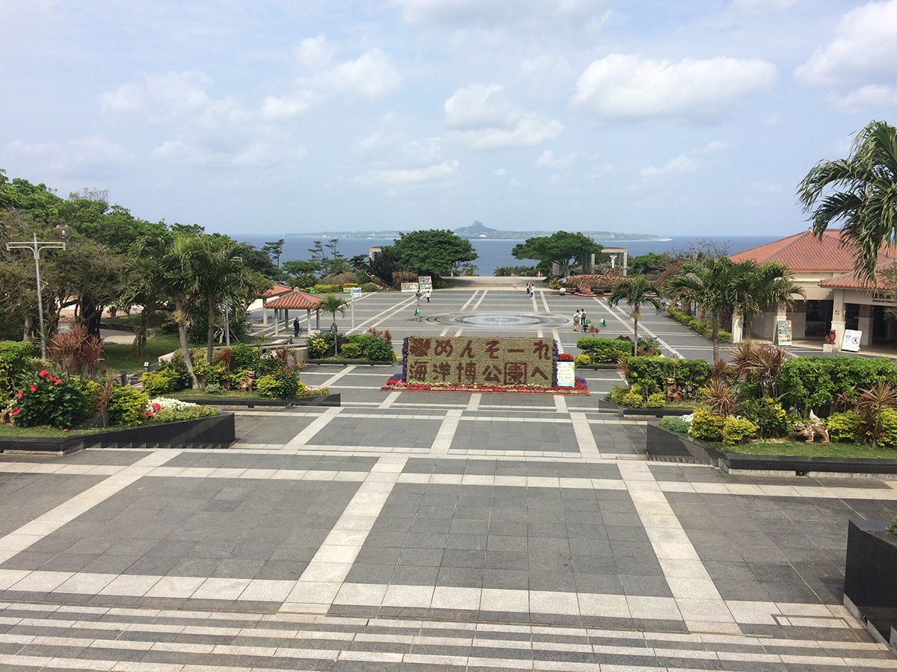
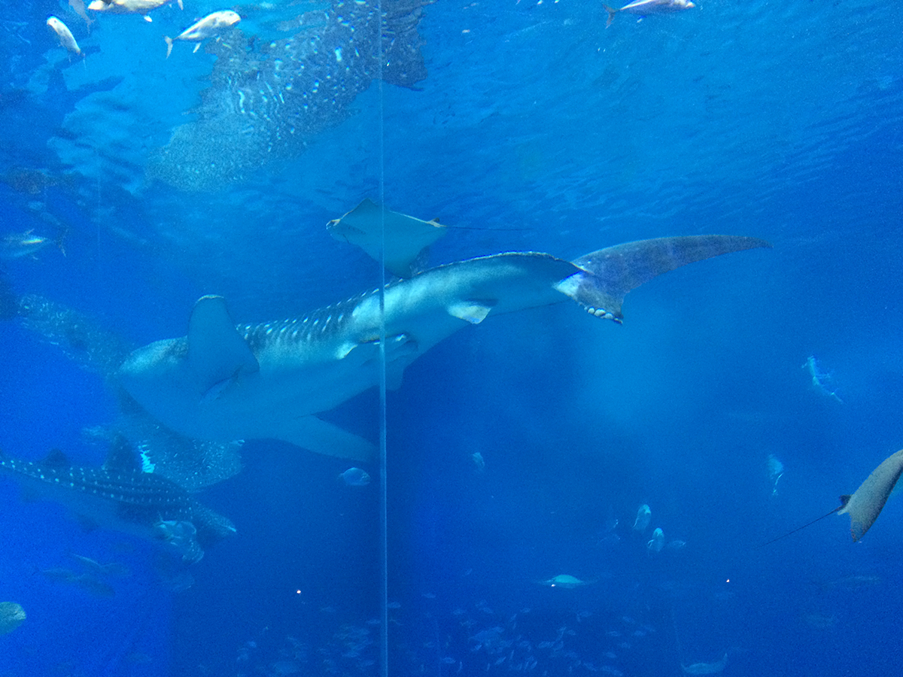
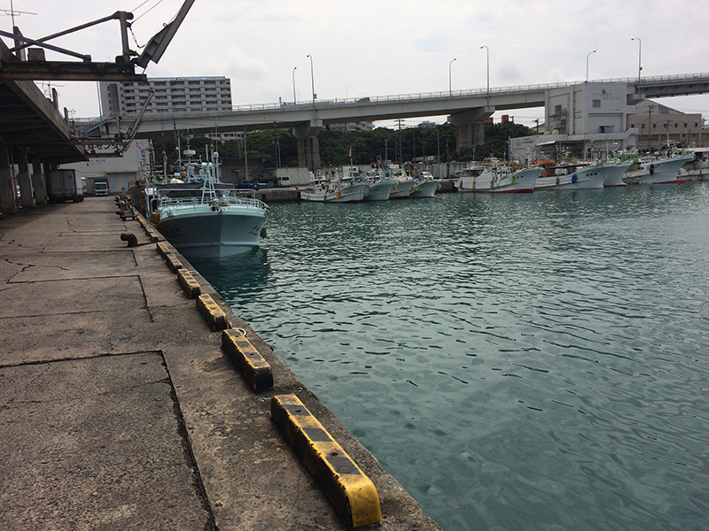

# 文章-冲绳

## 记录冲绳游玩的经历

17年上半年公司组织去了冲绳游玩

线路安排

海洋博 ，琉球村, 美国冲绳基地，美国村

## 入住的海边酒店

到酒店的第一晚 就趁着夜色海边沙滩走了，心情激动，后半夜有不少机车暴走族在门前的路上呼啸而过

## 海洋博

75年国际海洋博览会基础上起来， 除了有最大的鲸鲨 还有其他种类的海洋生物，种类繁多, 海边浴场（海水真鸡儿咸 不过算是人生第一次海水浴）

市区的其他景区，

琉球皇宫（当年算是中国附属国，不过国难当头没心思照顾），

鱼市场 算是深度游体验了看着渔民下船卸鱼，冲绳红灯区 citywalk

