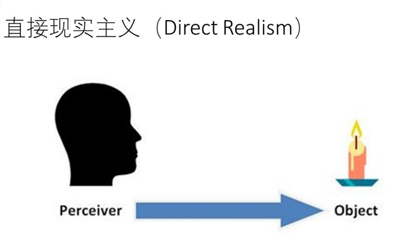
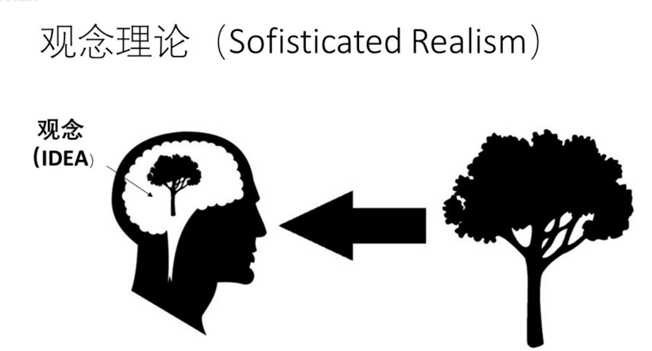

# 形而上学
**记录孤独的阅读者里面的哲学课**

## Direct Realism 直接现实主义
- 含义：观察到啥就是啥
- 问题：会因为观察差异，发生变化（观察者的不同，距离的不同）
这样的话，观察到的事物，和大脑中的观念 不能直接划等号
引出下面的这个主义(观念理论主义)

## 观念理论主义(Sophisticated Realism )
- 含义：不在
- 问题：
观念和物理物体有本质的区别
人除了观念之外 还能不能其他方式观察
世界上除了观念 还有其他物体

## 总结：形而上学
为了解决是观念，抽象问题，物理学没有办法直接解决的问题